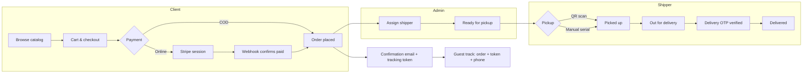

# Verdalis Foods — Site Catalog

Monorepo for **Verdalis Foods** (Prime Fine Foods): a Laravel API backend and three React (Vite) frontends for customers, administrators, and delivery shippers.

## Architecture

| App | Path | Dev URL | Role |
|-----|------|---------|------|
| **API** | `Back/` | http://localhost:8000 | Laravel 12 REST API, auth, orders, mail |
| **Client** | `Front/Client_side/` | http://localhost:5174 | Public storefront, cart, checkout, account |
| **Admin** | `Front/Admin_side/` | http://localhost:5175 | Products, orders, shippers, analytics |
| **Shipper** | `Front/Shippers_side/` | http://localhost:5176 | Routes, QR/manual pickup, delivery |

In development, each frontend proxies `/api` and `/sanctum` to the Laravel server (`VITE_API_URL=/api`).

## Prerequisites

- **PHP** 8.2+ with extensions: `pdo_mysql`, `mbstring`, `openssl`, `tokenizer`, `xml`, `ctype`, `json`, `bcmath`
- **Composer**
- **Node.js** 18+ and npm
- **MySQL** 8 (database name e.g. `prime_fine_foods`)

## Quick start

### 1. Backend

```bash
cd Back
cp .env.example .env
composer install
php artisan key:generate
php artisan migrate
php artisan serve
```

Configure `Back/.env`: database credentials, mail (`MAIL_*`), and optional `GOOGLE_CLIENT_ID`, `STRIPE_*`.

For local dev without Redis, use database drivers (see comments in `.env.example`):

```env
CACHE_STORE=database
QUEUE_CONNECTION=database
SESSION_DRIVER=database
SESSION_SECURE_COOKIE=false
```

OTP and transactional emails send **synchronously** (not queued). Ensure SMTP is configured and test with a real inbox.

### 2. Frontends

Install and run each app in a separate terminal:

```bash
# Client
cd Front/Client_side
cp .env.example .env
npm install
npm run dev

# Admin
cd Front/Admin_side
cp .env.example .env
npm install
npm run dev

# Shipper
cd Front/Shippers_side
cp .env.example .env
npm install
npm run dev
```

Production build: `npm run build` in each `Front/*` folder (output in `dist/`).

## Project structure

```
PRIME_site_catalog/
├── Back/                 # Laravel API
│   ├── app/              # Controllers, models, services, mail
│   ├── routes/api.php    # API routes
│   ├── database/         # Migrations, seeders
│   └── API.md            # API reference
├── Front/
│   ├── Client_side/      # Customer React SPA
│   ├── Admin_side/       # Admin React SPA
│   └── Shippers_side/    # Shipper React SPA
└── README.md
```

## Main features

**Client**

- Product catalog, cart, checkout (COD / online)
- Client & retailer registration with email OTP
- Login (password + OTP), Google sign-in, forgot password
- Order tracking (order number + tracking token + phone last 4)
- Dashboard: orders, profile

**Admin**

- Products, categories, stores, clients, retailers
- Order management, shipper assignment, payments
- Contact messages, questions, warehouse settings

**Shipper**

- Assigned orders, route map, GPS-validated pickup & delivery
- QR warehouse pickup or **manual pickup** (truck number + credentials → email serial)
- Delivery OTP to customer email

## System workflow

End-to-end flow from browse to delivery:



### Customer journey

1. **Register / login** — Email OTP on signup and login; optional Google OAuth; forgot-password flow.
2. **Shop** — Public catalog; retailers see wholesale pricing after admin approval.
3. **Checkout** — Profile must be complete; stock reserved on order; COD or Stripe online payment.
4. **Confirmation** — Order email with line items, total, and **tracking token**; in-app notification.
5. **Track** — Guests need order number, tracking token, and phone last 4; logged-in owners can track with fewer fields.

### Order lifecycle

| Status | Typical trigger |
|--------|-----------------|
| `pending_payment` | Online order created, awaiting Stripe |
| `paid` | Payment confirmed (webhook or admin) |
| `preparing` | Fulfillment started |
| `ready_for_pickup` | Ready at warehouse; shipper assigned |
| `picked_up` | Shipper scans QR or confirms manual serial |
| `out_for_delivery` | En route to customer |
| `delivered` | Shipper enters delivery OTP + GPS proof |
| `failed_delivery` / `cancelled` | Exception paths (state machine enforced) |

### Shipper & delivery handoff

1. Admin assigns order → shipper sees it on **Ready for Pickup**.
2. **Pickup** — Encrypted warehouse QR **or** manual flow: truck number + shipper password + company PIN → one-time serial emailed to shipper.
3. **Delivery** — 6-digit OTP emailed to customer; shipper verifies at door with GPS radius check; optional photo/signature.

### Retailer wholesale

1. Register as retailer → email OTP → account created as `pending`.
2. Admin approves → retailer can place wholesale orders with tiered pricing.

---

## Security features

Defense in depth across auth, orders, and logistics:

### Authentication & sessions

- **Laravel Sanctum** — Stateful SPA cookies per portal (client, admin, shipper) with HTTP-only auth cookies.
- **Role separation** — `client`, `retailer`, `admin`, and `shipper` routes isolated by middleware; cross-portal login blocked with clear errors.
- **Two-step login** — Password then email OTP for clients; admin OTP; shipper password + **company PIN**.
- **Email OTP** — 6-digit codes, 15-minute TTL, single-use; purposes: register, login, password reset.
- **Google OAuth** — Token verified server-side; new users flagged until profile complete.
- **Admin inactivity timeout** — Auto-logout after idle period on admin routes.

### Order & tracking

- **Tracking token** — 64-char secret per order; guest tracking requires token **and** phone last 4 (not order number alone).
- **Encrypted QR payloads** — Warehouse QR uses encrypted order + delivery token with expiry and one-time use.
- **Manual pickup serial** — 8-char one-time code, hashed at rest, 15-minute expiry, emailed to verified shipper.
- **Delivery OTP** — Hashed 6-digit code; max 5 attempts then 15-minute lockout.
- **GPS validation** — Pickup and delivery require valid coordinates; delivery must be within configured radius of shipping address.

### API & infrastructure

- **Rate limiting** — Per-IP and per-email throttles on auth, OTP, track, contact, shipper scan, and delivery endpoints.
- **CSRF** — Sanctum CSRF cookie + `X-XSRF-TOKEN` for stateful API requests from SPAs.
- **Security headers** — `X-Content-Type-Options`, `X-Frame-Options`, `Referrer-Policy`, CSP (production HSTS).
- **CORS** — Explicit allowed origins for the three frontend ports/domains.
- **Payments** — Stripe webhook signature verification; no client-side payment confirmation; idempotent checkout sessions.
- **Stock reservations** — Inventory locked on order; stale reservations released by scheduled job.

### Audit & compliance

- **Audit log** — Login failures, password resets, order creation, pickup/delivery, QR failures, payment actions.
- **Retailer approval** — Wholesale orders blocked until `retailer_status = approved`.
- **Secrets** — `.env` gitignored; passwords bcrypt-hashed; delivery/pickup codes stored hashed only.

---

## Portfolio value

What this project demonstrates for stakeholders, employers, or case studies:

### Full-stack product delivery

- **One API, three audiences** — Shared Laravel backend serving customer storefront, internal admin, and field shipper app without duplicating business logic.
- **Modern frontends** — React 18, Vite 6, lazy routes, proxy-based dev ergonomics, production code-splitting (maps, motion, scanner chunks).

### Domain depth (food wholesale & logistics)

- B2C and **B2B retailer** flows with approval gates and role-based pricing.
- **Last-mile logistics** — QR handoff, manual fallback, GPS proof, customer delivery OTP.
- **Operations dashboard** — Catalog, orders, shippers, payments, analytics, and warehouse settings in one admin surface.

### Engineering quality

- **Stateful order machine** — Explicit transitions prevent invalid status jumps.
- **Security-first auth** — Multi-factor patterns (OTP, PIN, tokens) appropriate for commerce and delivery.
- **Observable operations** — Audit trail and structured mail flows (confirmation, OTP, pickup serial).
- **Integration-ready** — Gmail SMTP, Google Sign-In, Stripe, OpenStreetMap/Leaflet.

### Business outcomes

| Capability | Value |
|------------|--------|
| Self-service ordering | Reduces phone/email order load |
| Retailer onboarding | Scalable wholesale channel with admin control |
| Track & trace | Customer transparency; fewer support inquiries |
| Shipper app | Accountability, GPS trail, proof of delivery |
| Admin console | Single pane for catalog, fulfillment, and payments |

### Tech stack summary

| Layer | Technologies |
|-------|----------------|
| Backend | PHP 8.2, Laravel 12, Sanctum, MySQL |
| Frontends | React, React Router, Vite, Framer Motion, Leaflet |
| Auth | Cookie sessions, OTP email, Google OAuth |
| Payments | Stripe Checkout + webhooks |
| Mail | SMTP (transactional OTP & notifications) |

---

## Environment highlights

| Variable | Where | Purpose |
|----------|-------|---------|
| `DB_*` | `Back/.env` | MySQL connection |
| `MAIL_*` | `Back/.env` | SMTP for OTP, order confirmation, pickup serial |
| `GOOGLE_CLIENT_ID` | `Back/.env` + `VITE_GOOGLE_CLIENT_ID` | Google OAuth (client app) |
| `STRIPE_*` | `Back/.env` | Online payments |
| `CORS_ALLOWED_ORIGINS` | `Back/.env` | Frontend dev/production origins |
| `VITE_API_URL` | `Front/*/.env` | `/api` in dev (proxied) |
| `FRONTEND_URL` | `Back/.env` | Optional; links in order emails (default `http://localhost:5174`) |

Copy from each package’s `.env.example`; never commit real `.env` files.

## API documentation

See [Back/API.md](Back/API.md) for public and authenticated endpoints.

Base URL in dev: `http://localhost:8000/api`

## Default admin (local)

On boot, Laravel can create/update an admin from `Back/.env`:

- `APP_ADMIN_EMAIL`
- `APP_ADMIN_PASSWORD`
- `APP_ADMIN_NAME`

Use the **Admin** app at http://localhost:5175 to sign in.

## Troubleshooting

| Issue | Check |
|-------|--------|
| 401 / session lost on admin or client | `SESSION_SECURE_COOKIE=false` locally; CORS/Sanctum domains in `.env` |
| OTP email not received | SMTP settings; check recipient inbox (not only sender Gmail); `storage/logs/laravel.log` when `APP_DEBUG=true` |
| CSRF / 419 on login | Frontends must use proxy (`VITE_API_URL=/api`); restart Vite after env changes |
| Shipper camera blocked | Use **Manual confirm** on scan page |

## License

Proprietary — Verdalis Foods / Prime Fine Foods. Internal use unless otherwise specified.
